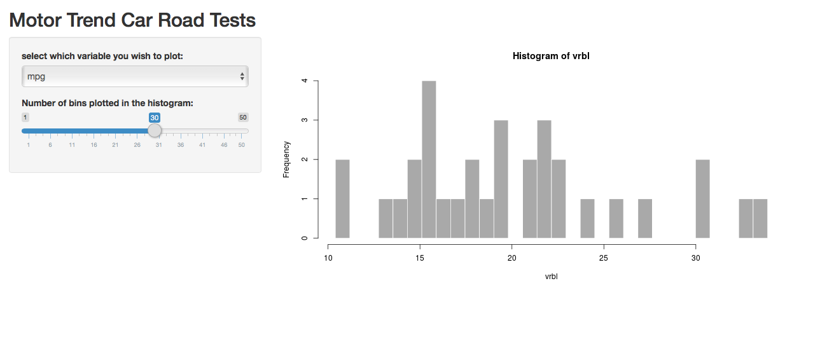

## Reproducible Pitch Presentation

This Application uses data about motor trend car road test dataset, To demonstrate various capabilities from the Developing Data Products Course. The Application provides visualization about cars' miles per gallon performance.

Using Shiny UI Server Application.

Adding customization to the plot.
One Input Widget (Slide Bar).
Using Reactive function.
Shiny Application Link : https://omersect.shinyapps.io/project/ Github Repository Link : https://github.com/omershect/Course-Project-Shiny-Application-and-Reproducible-Pitch

## The Data

The data was extracted from the 1974 Motor Trend US magazine, and comprises fuel consumption and 10 aspects of automobile design and performance for 32 automobiles (1973–74 models).

It is a data frame with 32 observations on 11 (numeric) variables.

[, 1]	mpg	Miles/(US) gallon
[, 2]	cyl	Number of cylinders
[, 3]	disp	Displacement (cu.in.)
[, 4]	hp	Gross horsepower
[, 5]	drat	Rear axle ratio
[, 6]	wt	Weight (1000 lbs)
[, 7]	qsec	1/4 mile time
[, 8]	vs	Engine (0 = V-shaped, 1 = straight)
[, 9]	am	Transmission (0 = automatic, 1 = manual)
[,10]	gear	Number of forward gears
[,11]	carb	Number of carburetors

## The Application Functionality
You can select the variable you wish to plot

You can slide the number of bins for the histogram plotted

## Application User Interface

